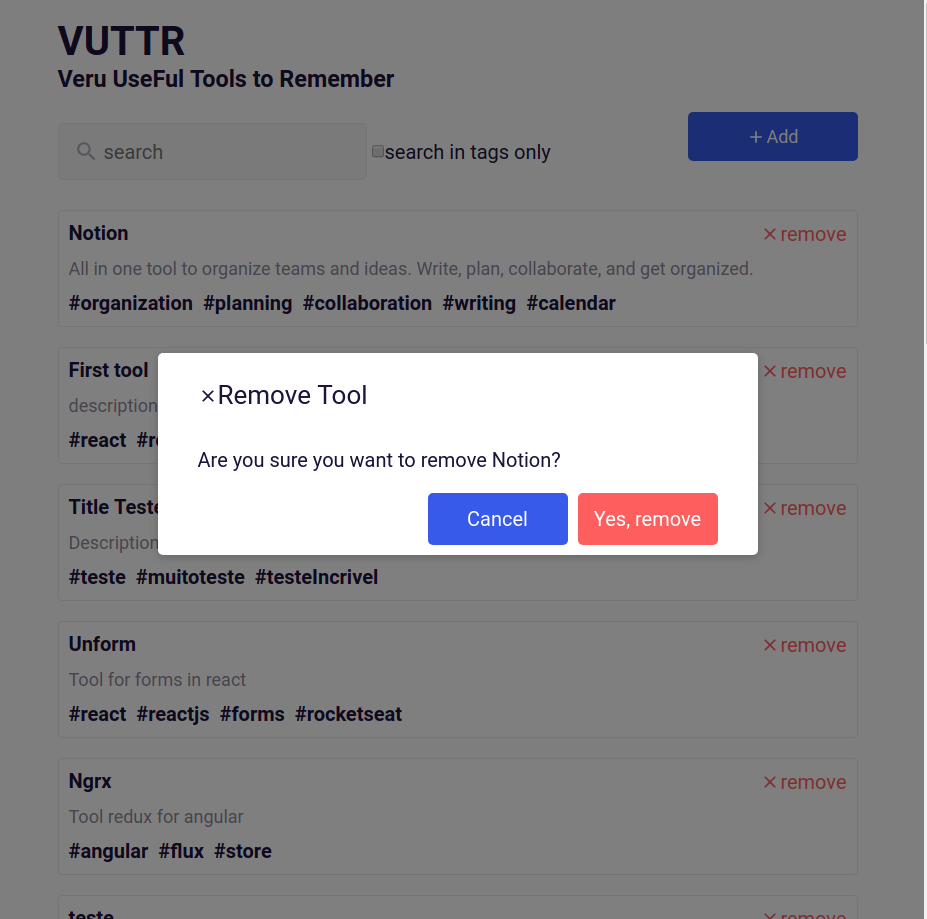

[](https://app.netlify.com/sites/upbeat-neumann-734fdd/deploys)

[](https://travis-ci.org/santanarscs/learn-test-jest)
[](./license.md)
[](https://github.com/santanarscs/learn-test-jest/graphs/contributors)

# VUTTR - Very Useful Tools to Rebember
This project was created for challenge frontend bossabox

#### List tools


#### List tools with filter


#### Add tool


#### Remove tool



## Tips for start app

Using json-server ([https://github.com/typicode/json-server])

### Run app
```shell
# run database
$ json-server -p 3333 -w
# start app
$ yarn start
```
