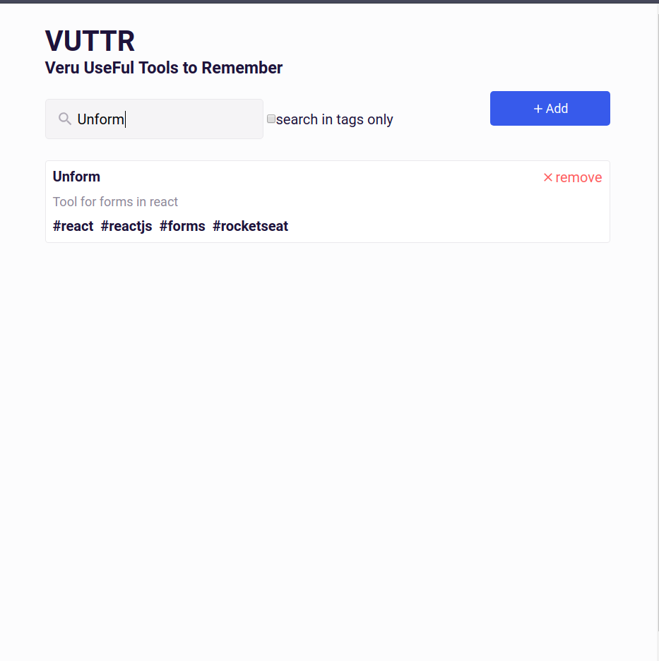

[](https://travis-ci.org/santanarscs/learn-test-jest)

# VUTTR - Very Useful Tools to Rebember
This project was created for challenge frontend bossabox

#### List tools


#### List tools with filter



#### Add tool


#### Remove tool


## Tips for start app

Using json-server ([https://github.com/typicode/json-server])

### Run app
```shell
# run database
$ json-server -p 3333 -w
# start app
$ yarn start
```
